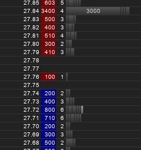

## Enumerations

---

### Market data

<pre><code class="cpp" data-line-numbers="|1-6|5|8|9|10" data-trim>
// Must be 13 bytes long.
struct MessageHeader {
  uint64_t sequence_num;
  uint32_t message_size;
  char type;             // 'A', 'M' or 'D'
};

struct AddMessage { /*...*/ };
struct DeleteMessage { /*...*/ };
struct ModifyMessage { /*...*/ };
</code></pre>

---

### First things first

<pre><code class="cpp" data-line-numbers="|1" data-trim>
// Must be 13 bytes long.
struct MessageHeader {
  uint64_t sequence_num;
  uint32_t message_size;
  char type;             // 'A', 'M' or 'D'
};
</code></pre>

---

### First things first

<pre><code class="cpp" data-line-numbers="7" data-trim>
struct MessageHeader {
  uint64_t sequence_num;
  uint32_t message_size;
  char type;             // 'A', 'M' or 'D'
};

static_assert(sizeof(MessageHeader) == 13);
</code></pre>

<pre class=fragment>
error: static assertion failed
 | static_assert(sizeof(MessageHeader) == 13);
 |               ~~~~~~~~~~~~~~~~~~~~~~^~~~~
</pre>
---

### First things first

<pre><code class="cpp" data-line-numbers="1" data-trim>
struct [[gnu::packed]] MessageHeader {
  uint64_t sequence_num;
  uint32_t message_size;
  char type;      // One of 'A', 'M', 'D' etc
};

static_assert(sizeof(MessageHeader) == 13);
</code></pre>

---

### Handling

<pre><code class="cpp" data-line-numbers="|1-3|5-9|11-12" data-trim>
void handle(const AddMessage &add);
void handle(const ModifyMessage &mod);
void handle(const DeleteMessage &del);

template&lt;typename Msg>
void handle(const void *payload) {
  handle(*static_cast&lt;const Msg *>(
    payload));
}

void on_message(const MessageHeader &hdr, 
                const void *payload);
</code></pre>

---

### Handling

<pre><code class="cpp" data-line-numbers data-trim>
void on_message(const MessageHeader &hdr, 
                const void *payload) {
  if (hdr.type == 'A') {
    handle&lt;AddMessage>(payload);
  } else if (hdr.type == 'M') {
    handle&lt;ModifyMessage>(payload);
  } else if (hdr.type == 'D') {
    handle&lt;DeleteMessage>(payload);
  }
}
</code></pre>

---

### Handling

<pre><code class="cpp" data-line-numbers data-trim>
void handle(const MessageHeader &hdr, 
            const void *payload) {
  switch (hdr.type) {
  case 'A': 
    handle&lt;AddMessage>(payload);
    break;
  case 'M': 
    handle&lt;ModifyMessage>(payload);
    break;
  case 'D':
    handle&lt;DeleteMessage>(payload);
    break;
  }
}
</code></pre>

---

### Enumerations

<pre><code class="cpp" data-line-numbers data-trim>
enum class MessageType : char {
  Add = 'A',
  Modify = 'M',
  Delete = 'D'
};
</code></pre>

---

### Enumerations

<pre><code class="cpp" data-line-numbers="|4" data-trim>
struct MessageHeader {
  uint64_t sequence_num;
  uint32_t message_size;
  MessageType type;
};
static_assert(sizeof(MessageHeader) == 13);
</code></pre>

---

### Enumerations

<pre><code class="cpp" data-line-numbers data-trim>
void handle(const MessageHeader &hdr, 
            const void *payload) {
  switch (hdr.type) {
  case 'A': 
    return handle&lt;AddMessage>(payload);
  case 'M': 
    return handle&lt;ModifyMessage>(payload);
  case 'D':
    return handle&lt;DeleteMessage>(payload);
  }
  throw std::runtime_error(
    "Invalid message type " 
    + std::to_string(
        static_cast&lt;int>(hdr.type)));
}
</code></pre>

---

### So why is this better?

We forgot to handle a message!

---

### Trades!

<pre><code class="cpp" data-line-numbers="|5" data-trim>
enum class MessageType : char {
  Add = 'A',
  Modify = 'M',
  Delete = 'D',
  Trade = 'T'
};
</code></pre>

---

### Trades!

<pre>
In function 'void handle(const MessageHeader&, ...
warning: enumeration value 'Trade' 
  not handled in switch [-Wswitch]
 |   switch (hdr.type) {
 |          ^
</pre>

TODO: talk about Wall Wextra Werror etc? tradeoffs
---

## Summary
- `static_assert`
- Use enum classes for any choices
  - even sized ones
- Avoid `if`, use no-`default` `switch`
- Warnings as errors